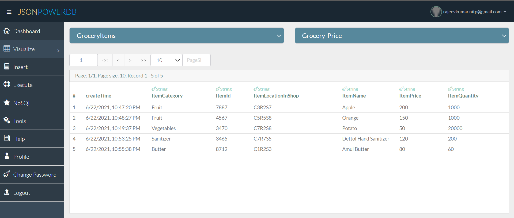
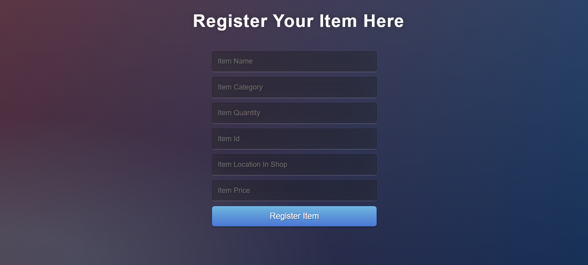
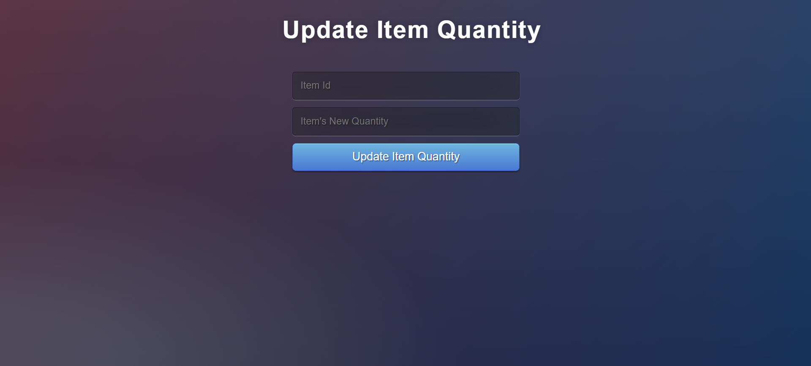
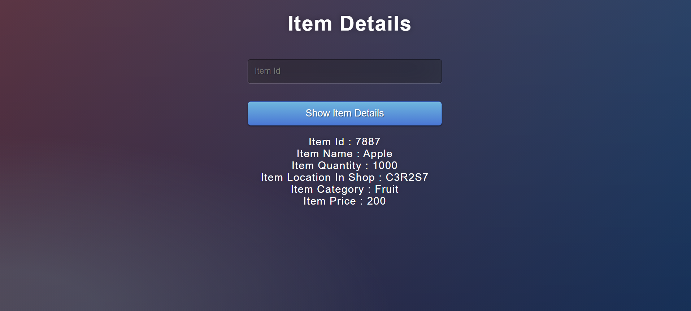

# Grocery-Management-System with JSONPowerDB
[JSONPowerDB](https://login2explore.com/jpdb/index.html)
### About JsonPowerDB:

- JsonPowerDB is a Real-time, High Performance, Lightweight and Simple to Use, Rest API based Multi-mode DBMS. JsonPowerDB has ready to use API for Json document DB, RDBMS, Key-value DB, GeoSpatial DB and Time Series DB functionality. JPDB supports and advocates for true serverless and pluggable API development.

### Benefits of using JsonPowerDB

- Simplest way to retrieve data in a JSON format.
- Schema-free, Simple to use, Nimble and In-Memory database.
- It is built on top of one of the fastest and real-time data indexing engine - PowerIndeX.
- It is low level (raw) form of data and is also human readable.
- It helps developers in faster coding, in-turn reduces development cost.

## Database of Grocery-Management-System

## Features of Grocery-Management-System
### Add Item

### Delete Item

### Update Item Quantity

### Query Item Details

### Example: Querying Item with Item Id

### USE : Update Your Token No from [JSONPowerDB](https://login2explore.com/jpdb/index.html) in each JS file.